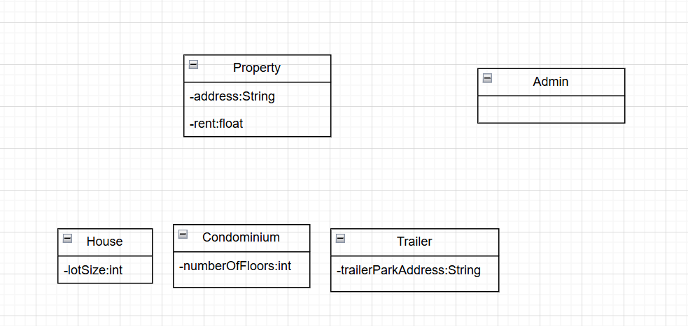

# MPP Lab1
## 1
### mWITHDRAW_MONEY Use Case Description: Main Flow

| Step | User Action | System Response |
|------|-------------|-----------------|
| 1 | User types in PIN into main screen | System checks validity of PIN and presents options to user on another screen |
| 2 | User selects "Withdraw Money" option | System prompts user to enter withdrawal amount |
| 3 | User enters withdrawal amount | System dispenses cash and displays confirmation |
### User story
As an ATM user, I want to withdraw cash from my account so that I can have money for personal expenses. 
## 2
### Usecase diagram

## 3
### Project Management System

## 4
### Property Management System
