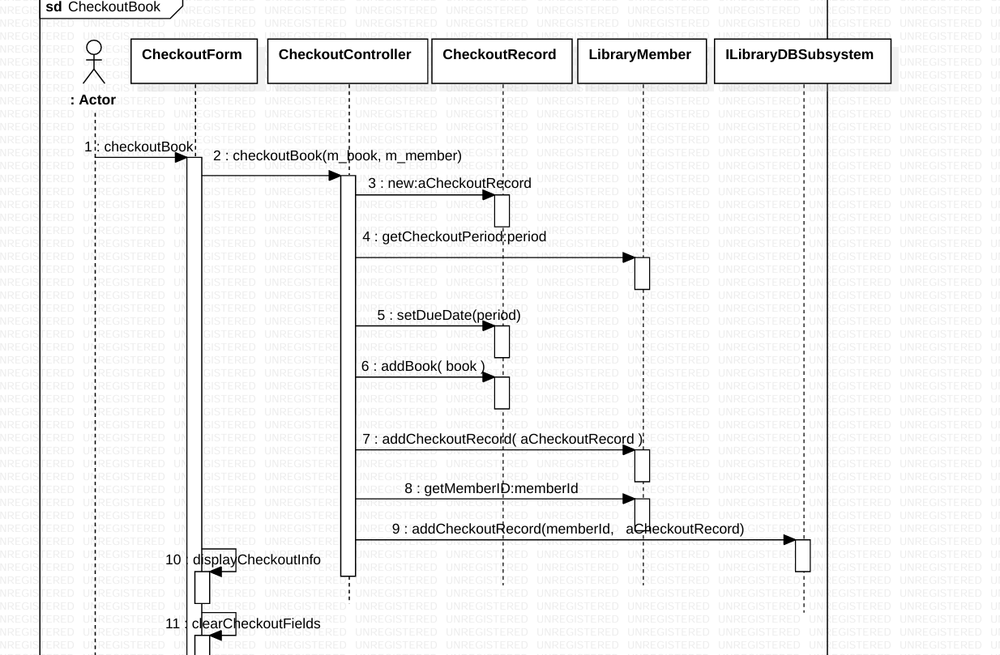

# Create a sequence diagram based on the flow that occurs when an actor invokes the 
checkoutBook() method on CheckoutForm 
//FROM CLASS CheckoutForm 
public void checkoutBook()  { 
theCheckoutController.checkoutBook(m_book, m_member);  
displayCheckoutInfo(); 
clearCheckoutFields(); 
} 
//FROM CLASS CheckoutController 
public void checkoutBook(Book book, LibraryMember member) { 
CheckoutRecord aCheckoutRecord = new CheckoutRecord(); 
aCheckoutRecord.setDueDate(member.getCheckoutPeriod()); 
aCheckoutRecord.addBook( book ); 
member.addCheckoutRecord( aCheckoutRecord ); 
theILibraryDBSubsystem.addCheckoutRecord(member.getMemberID(),  
aCheckoutRecord); 
} 

