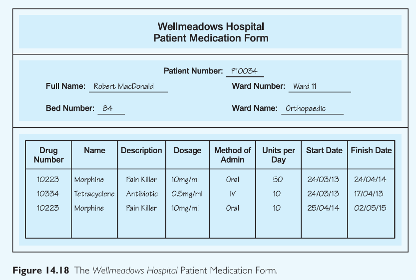

# Lab 6 – Problem 1  
## Database Normalization – Wellmeadows Hospital Case Study

## Question 14.14

## (a) Functional Dependencies

### Assumptions:
- Each **patient** has a unique `Patient Number`.
- Each **drug** is uniquely identified by its `Drug Number`.
- A medication record is uniquely identified by a combination of `Patient Number`, `Drug Number`, and `Start Date`.
- Wards are uniquely identified by `Ward Number`.

### Identified Functional Dependencies:
1. `Patient Number → Full Name, Bed Number, Ward Number`
2. `Ward Number → Ward Name`
3. `Drug Number → Name, Description, Dosage, Method of Admin`
4. `(Patient Number, Drug Number, Start Date) → Units per Day, Finish Date`

## (b) Normalization to 3NF

### **1NF** – Atomic attributes and no repeating groups.

Data is already in 1NF in the given form since each row represents one drug per patient.

### **2NF** – Remove partial dependencies.

Since the composite key is `(Patient Number, Drug Number, Start Date)`, move any attributes that are dependent only on a part of the key to separate tables.

#### Tables after 2NF:

**Patient Table**
- `Patient Number` (PK)
- `Full Name`
- `Bed Number`
- `Ward Number` (FK)

**Ward Table**
- `Ward Number` (PK)
- `Ward Name`

**Drug Table**
- `Drug Number` (PK)
- `Name`
- `Description`
- `Dosage`
- `Method of Admin`

**Medication Record Table**
- `Patient Number` (FK)
- `Drug Number` (FK)
- `Start Date`
- `Units per Day`
- `Finish Date`

Composite PK: `(Patient Number, Drug Number, Start Date)`

### **3NF** – Remove transitive dependencies.

- `Ward Name` depends on `Ward Number`, not directly on `Patient Number`, so it's already handled in `Ward` table.
- All non-key attributes are dependent only on the whole key and nothing else.

## (c) Keys

### **Patient Table**
- Primary Key: `Patient Number`
- Foreign Key: `Ward Number → Ward(Ward Number)`

### **Ward Table**
- Primary Key: `Ward Number`

### **Drug Table**
- Primary Key: `Drug Number`

### **Medication Record Table**
- Primary Key: `(Patient Number, Drug Number, Start Date)`
- Foreign Keys:
  - `Patient Number → Patient(Patient Number)`
  - `Drug Number → Drug(Drug Number)`