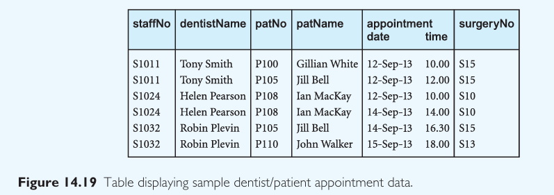

# Lab 6 – Problem 2  
## Database Normalization – Dentist/Patient Appointment Case

## Question 14.15

## (a) Update Anomalies

###  Insertion Anomaly:
Cannot insert a new dentist or surgery unless an appointment is scheduled.

###  Deletion Anomaly:
Deleting the last appointment of a dentist or surgery would remove all trace of that dentist or surgery.

###  Update Anomaly:
Changing a dentist's name or surgery number must be done in every row where they appear, risking inconsistency.

## (b) Functional Dependencies

### Assumptions:
- Each `staffNo` identifies one dentist.
- Each `patNo` identifies one patient.
- A dentist is assigned to only one surgery per day.
- The appointment is uniquely defined by: (`staffNo`, `appointment date`, `appointment time`).

### Functional Dependencies:
1. `staffNo → dentistName`
2. `patNo → patName`
3. (`staffNo`, `appointment date`) → `surgeryNo`
4. (`staffNo`, `appointment date`, `appointment time`) → `patNo`

## (c) Normalization to 3NF

###  1NF – Eliminate repeating groups

Already satisfied. Each row is atomic.

### 2NF – Remove partial dependencies

#### Step 1: Identify composite key: (`staffNo`, `appointment date`, `appointment time`)
- Remove partial dependencies into separate tables.

#### Tables in 2NF:

**Dentist**
- `staffNo` (PK)
- `dentistName`

**Patient**
- `patNo` (PK)
- `patName`

**SurgeryAssignment**
- `staffNo`
- `appointment date`
- `surgeryNo`
- **PK**: (`staffNo`, `appointment date`)

**Appointment**
- `staffNo`
- `appointment date`
- `appointment time`
- `patNo`
- **PK**: (`staffNo`, `appointment date`, `appointment time`)

###  3NF – Remove transitive dependencies

All remaining non-key attributes now depend **only** on the key. No transitive dependencies remain.

## Final 3NF Tables

### Dentist
- `staffNo` (PK)
- `dentistName`

### Patient
- `patNo` (PK)
- `patName`

### SurgeryAssignment
- `staffNo` (PK)
- `appointment date` (PK)
- `surgeryNo`

### Appointment
- `staffNo` (PK)
- `appointment date` (PK)
- `appointment time` (PK)
- `patNo` (FK)

##  Keys

### Primary Keys:
- Dentist: `staffNo`
- Patient: `patNo`
- SurgeryAssignment: (`staffNo`, `appointment date`)
- Appointment: (`staffNo`, `appointment date`, `appointment time`)

### Foreign Keys:
- `Appointment.patNo → Patient.patNo`
- `Appointment.staffNo, appointment date → SurgeryAssignment.staffNo, appointment date`

