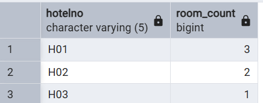

# Lab 7 - SQL Queries and Results

This document includes SQL queries and screenshots of their results from the `hoteldb` schema.

---

## Simple Queries

### 6.7 List full details of all hotels
```sql
SELECT * FROM Hotel;
```


---

### 6.8 List full details of all hotels in London
```sql
SELECT * FROM Hotel WHERE city = 'London';
```


---

### 6.9 List names and addresses of guests living in London, ordered by name
```sql
SELECT guestName, guestAddress 
FROM Guest 
WHERE guestAddress LIKE '%London%' 
ORDER BY guestName;
```


---

### 6.10 List double or family rooms priced below £40, ascending by price
```sql
SELECT * FROM Room 
WHERE type IN ('Double', 'Family') AND price < 40.00 
ORDER BY price;
```


---

### 6.11 List bookings with no dateTo specified
```sql
SELECT * FROM Booking WHERE dateTo IS NULL;
```


---

## Aggregate Functions

### 6.12 How many hotels are there?
```sql
SELECT COUNT(*) AS hotel_count FROM Hotel;
```


---

### 6.13 What is the average price of a room?
```sql
SELECT AVG(price) AS avg_room_price FROM Room;
```


---

### 6.14 Total revenue per night from all double rooms
```sql
SELECT SUM(price) AS total_double_revenue 
FROM Room 
WHERE type = 'Double';
```


---

### 6.15 Number of different guests with August bookings
```sql
SELECT COUNT(DISTINCT guestNo) AS august_guests 
FROM Booking 
WHERE EXTRACT(MONTH FROM dateFrom) = 8;
```


---

## Subqueries and Joins

### 6.16 Price and type of all rooms at the Grosvenor Hotel
```sql
SELECT price, type 
FROM Room
JOIN Hotel ON Room.hotelNo = Hotel.hotelNo
WHERE hotelName = 'Grosvenor Hotel';
```

---

### 6.17 All guests currently staying at the Grosvenor Hotel
```sql
SELECT Guest.* 
FROM Booking
JOIN Guest ON Booking.guestNo = Guest.guestNo
JOIN Hotel ON Booking.hotelNo = Hotel.hotelNo
WHERE hotelName = 'Grosvenor Hotel' 
  AND CURRENT_DATE BETWEEN dateFrom AND COALESCE(dateTo, CURRENT_DATE);
```


---

### 6.18 Details of all rooms at Grosvenor Hotel, and guest if occupied
```sql
SELECT Room.*, Guest.guestName 
FROM Room
JOIN Hotel ON Room.hotelNo = Hotel.hotelNo
LEFT JOIN Booking ON Room.roomNo = Booking.roomNo AND Room.hotelNo = Booking.hotelNo
LEFT JOIN Guest ON Booking.guestNo = Guest.guestNo
WHERE hotelName = 'Grosvenor Hotel';
```


---

### 6.19 Total income from bookings for Grosvenor Hotel today
```sql
SELECT SUM(Room.price) AS total_income 
FROM Booking
JOIN Room ON Booking.roomNo = Room.roomNo AND Booking.hotelNo = Room.hotelNo
JOIN Hotel ON Room.hotelNo = Hotel.hotelNo
WHERE hotelName = 'Grosvenor Hotel'
  AND CURRENT_DATE BETWEEN dateFrom AND COALESCE(dateTo, CURRENT_DATE);
```


---

## Grouping

### 6.22 Number of rooms in each hotel
```sql
SELECT hotelNo, COUNT(*) AS room_count 
FROM Room
GROUP BY hotelNo;
```


---

### 6.23 Number of rooms in each London hotel
```sql
SELECT Room.hotelNo, COUNT(*) AS room_count 
FROM Room
JOIN Hotel ON Room.hotelNo = Hotel.hotelNo
WHERE city = 'London'
GROUP BY Room.hotelNo;
```


---

### 6.24 Average number of bookings per hotel in August
```sql
SELECT AVG(numberofbookings) AS avg_booking 
FROM (
    SELECT hotelNo, COUNT(hotelNo) AS numberofbookings
    FROM Booking
    WHERE EXTRACT(MONTH FROM dateFrom) = 8
    GROUP BY hotelNo
) subquery;
```

